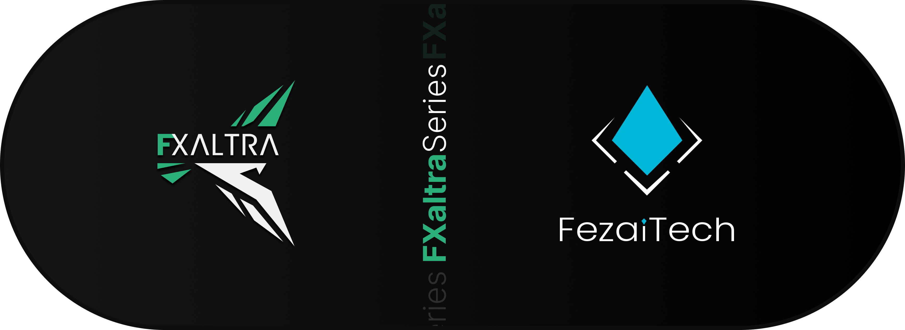

    <h1 align="center">FXaltra</h1>
    <h3 align="center">Simülasyondan Daha Fazlası:  Akıllı, Gerçekçi, Entegre!</h3>

---------
# ✈️ FXaltra: Gelişmiş Uçuş Simülasyonu ve Entegre Kablosuz Kontrol Sistemleri

FXaltra, gerçek uçuş koşullarını yüksek gerçekçilikte sanal ortama taşıyan bir uçuş simülasyonu projesidir. Proje, Unity tabanlı bir uçuş motoru, WPF ile geliştirilen yer kontrol istasyonu, Flutter ile hazırlanmış mobil kontrolcü ve Python + Leaflet tabanlı harita sistemi gibi birçok entegre bileşeni barındırır.

---------

## 🚀 Proje Özellikleri

- **Gerçekçi Uçuş Simülasyonu**
- **Masaüstü Yer İstasyonu**
- **Kablosuz Mobil Kontrolcü**
- **Harita Entegrasyonu**
- **Otonom Komut ve Görev Sistemi**
- **Gerçek Zamanlı İletişim**
- **Özgün Model ve Çevre Tasarımı**
- **Kontrol Güdüm Ve Mühimmat Yönetimi**
- **Radar Takip Entegre Sistemi**
- **Yapay Zeka İle Uçuş Kontrolü**

---------

## 🔧 Kurulum

> Bu repo aktif geliştirme sürecindedir ve duyuru reposudur. Proje repoları ayrı olarak barındırılmaktadır. Kurulum dokümantasyonu ve sürümler güncellenmektedir.

---------

## 🤝 Katkıda Bulunmak

FXaltra henüz açık kaynak değildir. Ancak topluluğa açık bir projedir. Bize yeteneklerinle katkıda bulunmanı çok isteriz.  

Katkı sağlamak isterseniz veya demo sürüme erişmek isterseniz bizimle iletişime geçebilirsiniz.

Eğer demo sürüme erişiminiz varsa:

- Hataları `Issues` sekmesinden bildirebilir,
- Geliştirmeler için `Pull Request` (PR) gönderebilir,
- Sorularınız için PR veya Issue altından iletişime geçebilirsiniz.

> Lütfen katkı öncesi `CONTRIBUTING.md` dosyasına göz atın (yakında eklenecek).

---------

## 🎬 Demo Video

📺 [Videoyu YouTube’da izle](https://www.youtube.com/watch?v=mceU2-mPfhQ)

---
## 🌟 Destek Ol

Projeye destek olmak için repo'yu **yıldızlamayı (⭐)** unutmayın!

---

**FezaiTech İletişim:**  
- [LinkedIn](https://www.linkedin.com/company/fezaitech)
- 📧 [fezaitech@gmail.com](mailto:fezaitech@gmail.com)

---------

